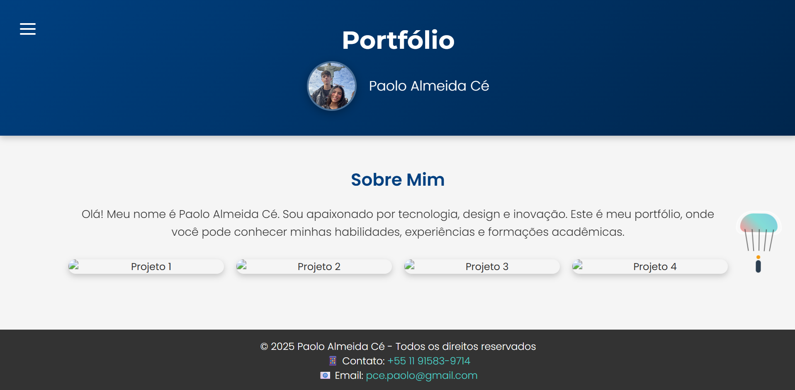

# Site Pessoal (HTML)

  

Site pessoal/portfólio feito com **HTML**, com páginas separadas para apresentar informações e organizar o conteúdo.

## 📄 Páginas

- **Home:** `index.html`
- **Cursando/Formação:** `cursando.html`
- **Habilidades:** `habilidades.html`
- **Experiência:** `experiencia.html`

## 🚀 Como rodar

### Opção 1 — abrir direto
1. Baixe/clone o repositório
2. Abra o arquivo **`index.html`** no navegador

### Opção 2 — Live Server (recomendado)
Se estiver no VS Code:
1. Instale a extensão **Live Server**
2. Clique com o botão direito em `index.html` → **Open with Live Server**

## 🗂️ Estrutura do projeto (resumo)

- `index.html` → página inicial
- `cursando.html` → formação / o que está cursando
- `habilidades.html` → skills
- `experiencia.html` → experiências
- `assets/` → arquivos estáticos (imagens, etc.)

## ✍️ Autor

Feito por **Paolo Almeida**.
